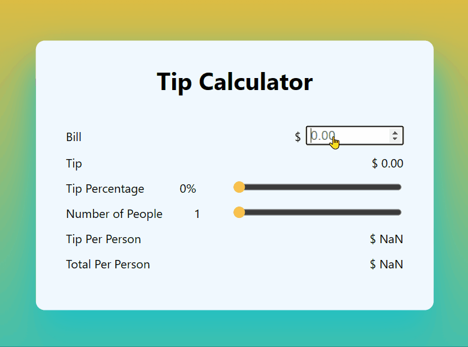

OverView: 
User can input Bill, set tip percentage and Number of people to calculate total tip, tip per person and total per person.

This WebApp is baseoff on the tip-calculator-with-react and tip-calculator-js.
Language used : Javascript, React.js, CSS.

I took what I learn from my 1st react tip calculator and build my own version plus some extra features.  

*very similar css styling to tip-calculator-with-js
